 <picture> 
    <source srcset="assets/gifs/banner-big.gif" 
    media="(min-width: 601px)" />
    <source srcset="assets/gifs/banner-small.gif" 
    media="(max-width: 600px)" />
    
</picture>

  

    

   
   

## ***Hi, Welcome to my profile*** <picture><source srcset="assets/gifs/waving.gif" media="min-width: 601px)" /><source srcset="assets/gifs/waving-sm.gif" media="(max-width: 600px)" /></picture>

> Always passionate about the IT world, over the years my personal projects have led me to study and grow in various sectors of the industry, from hardware, networks and systems to programming. At the moment, I am working as a back-end programmer, but I am also enhancing and applying my front-end abilities through different independent projects, integrating DevOps tools, cloud technologies, and modern development frameworks.
 

<!-- Contacts -->

    
    &nbsp;
    
    &nbsp;
    

 

<!-- Skills Section -->
<h2>🧱 Skills and Tools</h2>

FRONTEND ─────────────────────────────────────────────────────────

<picture><source srcset="generated/badges/html5-dark.svg" media="(prefers-color-scheme: dark)" />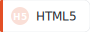</picture>
&nbsp;<picture><source srcset="generated/badges/css3-dark.svg" media="(prefers-color-scheme: dark)" />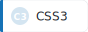</picture>
&nbsp;<picture><source srcset="generated/badges/javascript-dark.svg" media="(prefers-color-scheme: dark)" /></picture>
&nbsp;<picture><source srcset="generated/badges/typescript-dark.svg" media="(prefers-color-scheme: dark)" /></picture>
&nbsp;<picture><source srcset="generated/badges/vuejs-dark.svg" media="(prefers-color-scheme: dark)" /></picture>
&nbsp;<picture><source srcset="generated/badges/sass-dark.svg" media="(prefers-color-scheme: dark)" />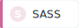</picture>
&nbsp;<picture><source srcset="generated/badges/bootstrap-dark.svg" media="(prefers-color-scheme: dark)" />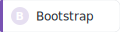</picture>
&nbsp;<picture><source srcset="generated/badges/jquery-dark.svg" media="(prefers-color-scheme: dark)" />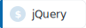</picture>

  

BACKEND ──────────────────────────────────────────────────────────

<picture><source srcset="generated/badges/java-dark.svg" media="(prefers-color-scheme: dark)" /></picture>
&nbsp;<picture><source srcset="generated/badges/spring-dark.svg" media="(prefers-color-scheme: dark)" /></picture>
&nbsp;<picture><source srcset="generated/badges/php-dark.svg" media="(prefers-color-scheme: dark)" />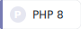</picture>
&nbsp;<picture><source srcset="generated/badges/laravel-dark.svg" media="(prefers-color-scheme: dark)" />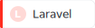</picture>
&nbsp;<picture><source srcset="generated/badges/rust-dark.svg" media="(prefers-color-scheme: dark)" />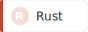</picture>

  

DATABASE &amp; DEVOPS ─────────────────────────────────────────────

<picture><source srcset="generated/badges/mysql-dark.svg" media="(prefers-color-scheme: dark)" />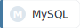</picture>
&nbsp;<picture><source srcset="generated/badges/postgresql-dark.svg" media="(prefers-color-scheme: dark)" /></picture>
&nbsp;<picture><source srcset="generated/badges/docker-dark.svg" media="(prefers-color-scheme: dark)" />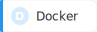</picture>

 
 

<!-- Stats Section -->

    

        <h2>My Stats 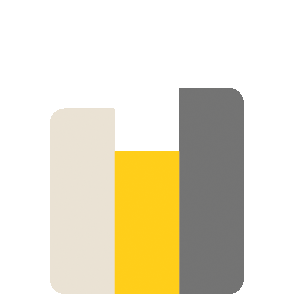</h2>
    

     
    

        <!-- Generated by GitHub Actions — see .github/workflows/update-stats.yml -->
        <picture>
            <source srcset="generated/langs-dark.svg" media="(prefers-color-scheme: dark)" />
            <source srcset="generated/langs-light.svg" media="(prefers-color-scheme: light), (prefers-color-scheme: no-preference)" />
            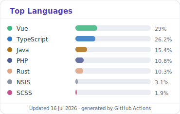
        </picture>
        &nbsp;
        <picture>
            <source srcset="generated/stats-dark.svg" media="(prefers-color-scheme: dark)" />
            <source srcset="generated/stats-light.svg" media="(prefers-color-scheme: light), (prefers-color-scheme: no-preference)" />
            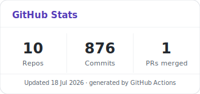
        </picture>
    

 

 

     

